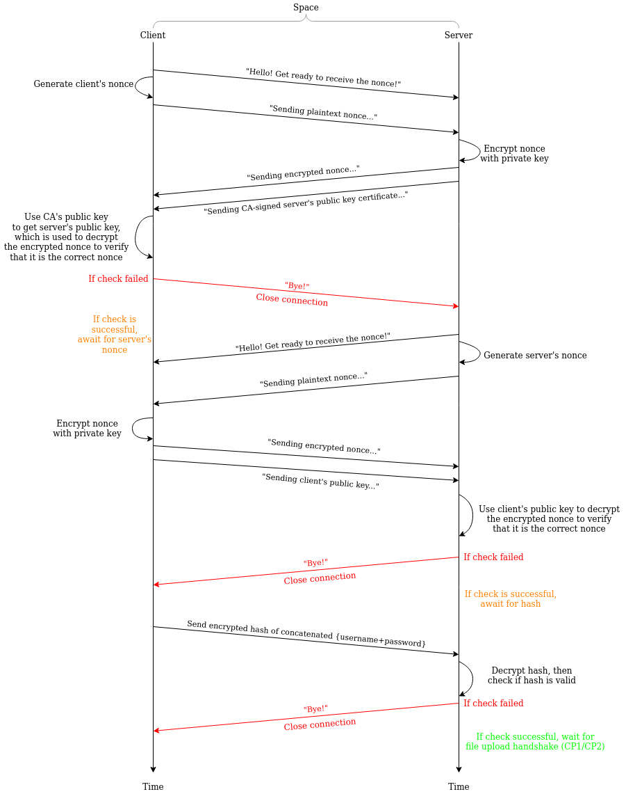
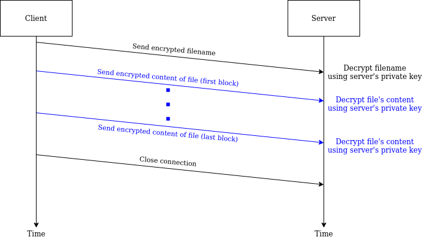
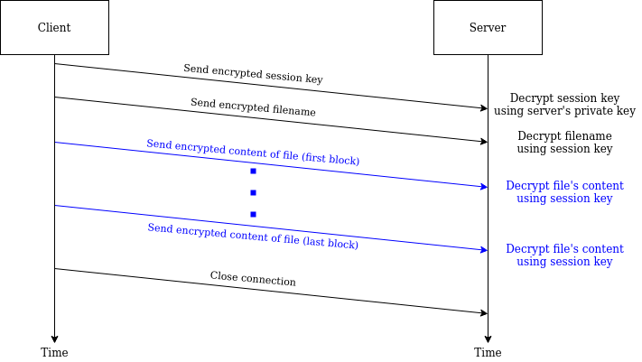

# Programming Assignment 2: Secure File Transfer Protocol

> Basic FTPS Implementation.

Team Members (Pair ID 0, Class CI03):

- [James Raphael Tiovalen](https://github.com/jamestiotio)
- [Leong Yun Qin Melody](https://github.com/caramelmelmel)

> Same partnership as PA1. We implement a custom modified (and fairly simplistic) version of FTPS over SSL/TLS instead of SFTP over SSH due to the requirements of the assignment.

In this programming assignment, we are tasked to implement a secure file upload application from a client to an Internet file server (following the client-server paradigm). By secure, we mean two properties. First, before you do your upload as the client, you should authenticate the identity of the file server so you won’t leak your data to random entities including criminals. Second, while carrying out the upload, you should be able to protect the confidentiality of the data against eavesdropping by any curious adversaries.

The server will be called `SecStore`. It’s an Internet server that is running at some IP address, ready to accept connection requests from clients. When a client has a file to upload, it will:

1. Initiate the connection,
2. Handshake with the server, and then
3. Perform the upload.

The CSE teaching staff will act as our trusted CA (Certificate/Certification Authority), their service being called `Csertificate`.

In particular, these are the basic requirements:

1. The server doesn’t have to interpret the content of the file, i.e., you can treat the file as a stream of bytes without worrying about the meaning of those bytes. 

2. However, you should be able to **handle arbitrary files** (e.g., binary files instead of say ASCII texts only), and your upload must be reliable. By **reliability**, we mean the server will store **exactly** what the client sent, **without any loss, reordering, or duplication of data**. Implement your file upload using standard *TCP sockets*.

3. The server must be able to *receive MULTIPLE file uploads* from the **same client** in the **same connection once established**, and only *TERMINATE* the connection upon request. **The starter code only receives one file and terminates. Modify this to support multiple file upload. You can make your code prompt for user input to key in filename, OR, put the filenames as ARGUMENTS before the program is run.**

4. Implement AP (Authentication *handshake* Protocol) in your file upload application.

5. Implement CP1 (Confidentiality Protocol 1) in your file upload application. This protocol uses RSA for data confidentiality.

6. Implement CP2 (Confidentiality Protocol 2) in your file upload application. This protocol uses AES for data confidentiality. Your protocol must negotiate a session key for the AES after the client has established a connection with the server. It must also ensure the confidentiality of the session key itself.

7. **Measure the data throughput** of CPL1 vs. CPL2 for uploading files of a range of sizes. Plot your results, and compare their performance.

System requirements: implemented in Java using the Java Cryptography Extension (JCE), which should already be included in a standard Java distribution.


## Credentials Preparation Instructions

> Since we are doing nonce-assisted authentication for both sides, both client and server need to generate their own pairs of private and public keys. However, only the server's public key is signed by the CA (as it should be in real life).

Run these commands to get the necessary credentials:

```console
# Generate a 4096-bit RSA key-pair
$ openssl genrsa -out example.org.key 4096

# Separate public key from private key
$ openssl rsa -in example.org.key -pubout -out example.org.pubkey

# Optionally inspect the content of the key files
$ openssl rsa -in example.org.key -noout -text

# Generate a certificate signing request file (only for server side)
$ openssl req -new -key example.org.key -out example.org.csr
```

Then, contact [@csesubmitbot](https://t.me/csesubmitbot), send the `/signcertificate` command, followed by uploading the CSR file (`example.org.csr`, in our case) to the Telegram Bot. After some processing time, if everything is okay, the bot will then provide the signed certificate back, which can be downloaded to your directory of choice (`credentials`, in our case). Do not forget to also obtain the CA's public key (`cacsertificate.crt`).

Finally, rename `example.org.key` to `example.org.pem` and run these commands to allow JCE to read the private and public parts of the `.key` file:

```console
# Get private key
$ openssl pkcs8 -topk8 -inform PEM -outform DER -in example.org.pem -out private_key.der -nocrypt

# Get public key
$ openssl rsa -in example.org.pem -pubout -outform DER -out public_key.der
```

Now, we are in business and good to go. Move along.


## Execution Instructions

To run this program, first ensure that all the dependencies are met:
- All the necessary required `.crt` and `.der` credential files are located in the `credentials/` folder (both client and server):
  - `cacsertificate.crt` (the CA's public key)
  - `client/private_key.der`
  - `client/public_key.der`
  - `server/private_key.der`
  - `server/certificate_100xxxx.crt` (the server's CA-signed public key)
- All the necessary files to be transferred over the network ready in the corresponding `data/` directory

After ensuring that all dependencies exist, compile both the client and server Java code files. Then, run the server program first on a terminal window, and then run the client program on a different terminal window.

During the initial AP handshake, the client will first download the server's CA-signed public key certificate (and put it inside `download/`), and then the server will download the client's public key (and put it inside `upload/`).

Any uploaded files to the server will be stored under the `upload/` folder, while any downloaded files by the client will be stored under the `download/` folder (all with respect to the current working directory where the programs are being run from).

Alternatively, for the purposes of the demo, ensure that the demo files are in their appropriate locations and run these commands to automate all the process above:

```console
$ chmod +x demo.sh
$ ./demo.sh
```


## Fixed Authentication Protocol

To recap, this is the original authentication handshake protocol specified in the handout:


The aforementioned authentication protocol is vulnerable to replay/playback attacks and susceptible to man-in-the-middle attacks for both sides (i.e., server does not know if it is talking to a live client and client does not know if it is talking to a live server), and the server cannot authenticate the client. The first issue can be solved via using freshly-generated nonces, which would be different for every session (which would prevent any malicious parties from just replaying or passing the messages back-and-forth in an attempt to either obtain the messages or perform malicious DDoS-related attacks). The second issue can be solved via login credentials (not using signed client certificates, which actually does not make sense in real life).

These would be the appropriate space-time diagrams of our corrected authentication protocol specifications:

- AP: 
- CP1: 
- CP2: 


## Performance Analysis & Comparison

We compare the performance of the client and server using different confidentiality protocols (i.e., CP1 vs. CP2) in terms of data throughput (using a single thread):


As clearly seen from the benchmarking plot, CP2 (using AES) is a much more performant data confidentiality protocol compared to CP1 (using RSA) for the purposes of file transfer.


## Future TODOs

In order of importance:

- Implement a sequence number tracker from each side so as to prevent partial playback/replay attack within a single session.
- Implement a concurrent, multi-threaded file data transfer method (either use threads or an executor with a fixed thread pool size; AtomicIntegers and CyclicBarriers might be needed). This is possible because we are using the ECB encryption mode of operation (for simplicity purposes).
- Encrypt other potentially exposed metadata, such as packet types, data stream buffer lengths, etc.
- Implement the auto demo script.
- Improve code modularity and refactor some structure of the codebase (client-side is quite repetitive and not that modular).
